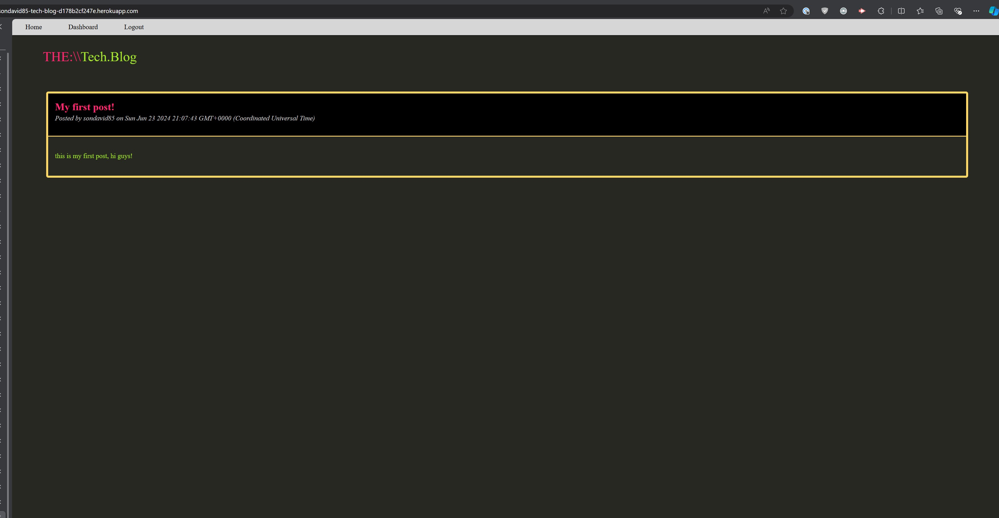

# Tech Blog 
  
  ## Description
  Tech blog with create user/login/logout functionality where users can create new posts or comment on existing posts.
  ## Deployed Application URL
  https://sondavid85-tech-blog-d178b2cf247e.herokuapp.com/
  ## Screenshot
  
  ## Table of Contents
  * [Features](#features)
  * [Languages & Dependencies](#languagesanddependencies)
  * [Usage](#Usage)
  * [Contributors](#contributors)
  * [Testing](#testing)
  * [Questions](#questions)
  ## Features
  Authentication/login, user creation, post creation, post comments
  ## Languages & Dependencies
  handlebars, sequelize, mysql
  ## Usage:
  dotenv, express, mysql, sequelize
  ## Contributors
  n/a
  ## Testing
  Create account and login. Once logged in, visit your dashboard to view your posts and create a new post. You should also be able to leave comments on existing posts.
  ## Questions
  Please send your questions [here](mailto:sondavid85@yahoo.com?subject=[GitHub]%20Dev%20Connect) or visit [github/sondavid85](https://github.com/sondavid85).
  